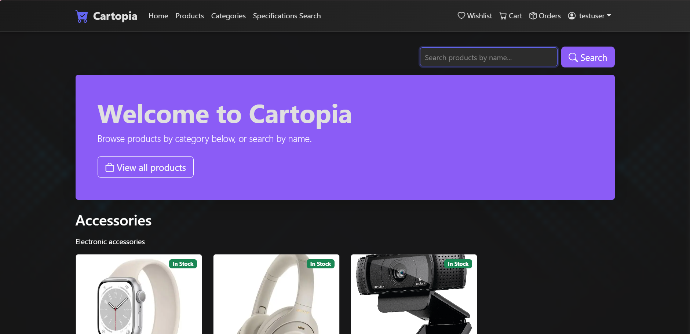
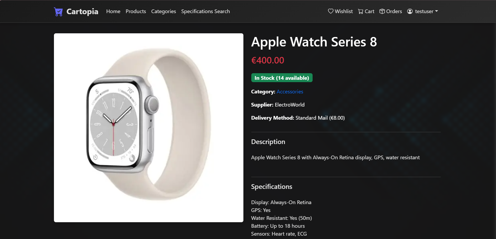
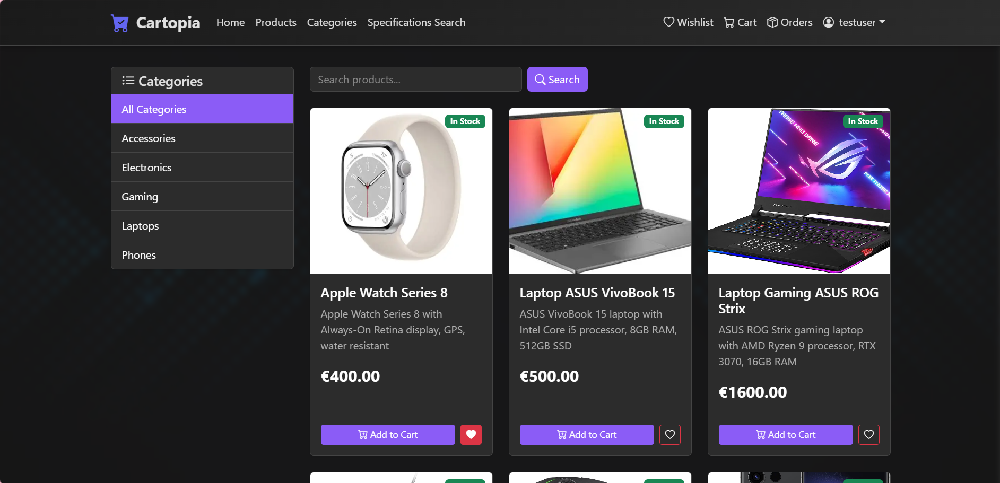
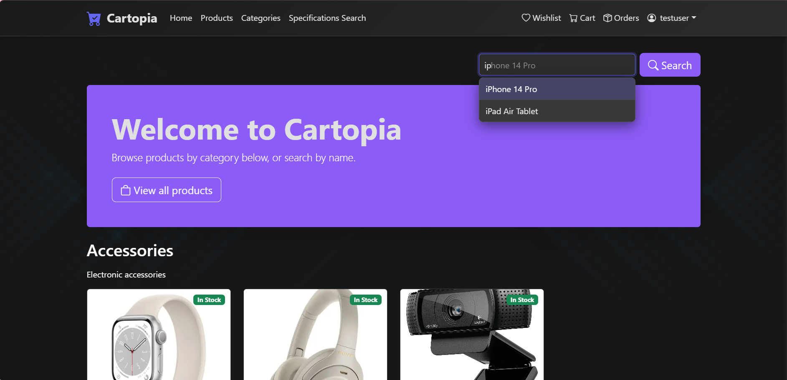
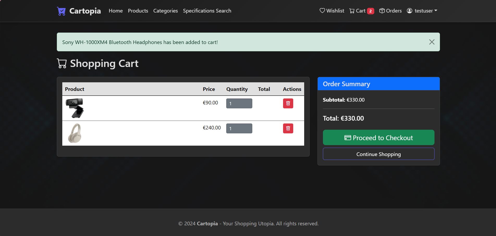
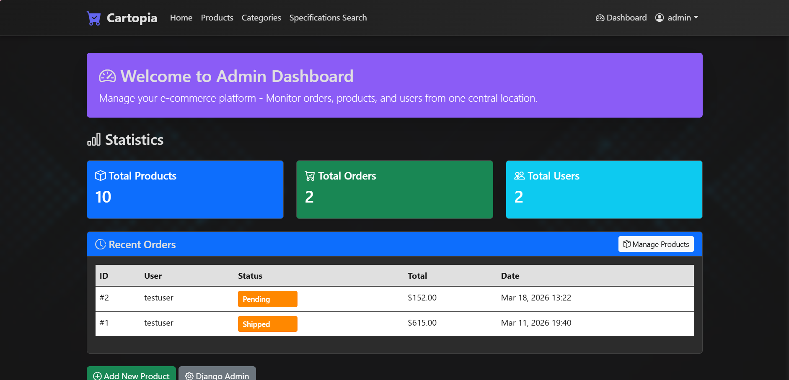
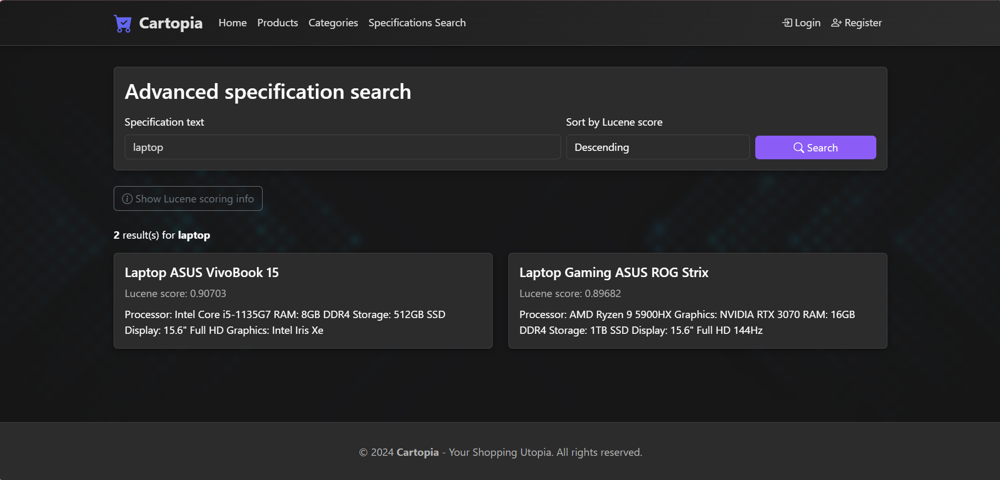

# Cartopia

A full-featured e-commerce web application built with Django, featuring advanced search capabilities including BM25 ranking, predictive autocomplete, TF-IDF similarity recommendations, and Apache Lucene full-text search over product specifications.


---

## Overview

Cartopia is a production-grade e-commerce platform that goes beyond standard online store functionality by integrating a multi-layered intelligent search engine. The platform combines a clean shopping experience with sophisticated Information Retrieval techniques — implemented both from scratch and via industry-standard tools.

---

## Screenshots

| Home Page | Product Detail | Search Results |
|-----------|---------------|----------------|
|  |  |  |

| Autocomplete | Shopping Cart | Admin Dashboard |
|-------------|--------------|-----------------|
|  |  |  |

| Specification Search |
|---------------------|
|  |

---

## Features

### Shopping Experience
- Product catalog organized by category with image galleries
- Product detail pages with specifications, reviews, and star ratings
- Shopping cart with quantity management and real-time totals
- Wishlist for saving products
- Checkout flow with configurable delivery methods
- Order history and status tracking (pending → processing → shipped → delivered)
- User registration, authentication, and profile management

### Search & Information Retrieval
- **BM25 full-text search** over product titles with substring and fuzzy matching (Levenshtein distance ≤ 2)
- **Predictive autocomplete** powered by a Trie (prefix tree) data structure with instant suggestions
- **Similarity recommendations** using TF-IDF vectorization + cosine similarity, displayed on each product page
- **Specification document search** via Apache Lucene BM25 scoring over extracted PDF content

### Admin & Staff Tools
- Dashboard with aggregate statistics (orders, revenue, active products)
- Full product CRUD with image and PDF upload
- Automatic PDF specification generation using ReportLab
- Order status management
- Review moderation system

---

## Tech Stack

| Layer | Technology |
|-------|-----------|
| Backend framework | Django 4.2 |
| Database | SQLite (via Django ORM) |
| Frontend | Bootstrap 5, Django Templates |
| ML / IR | scikit-learn (TF-IDF, cosine similarity) |
| Full-text search | Apache Lucene 9 (Java CLI via subprocess) |
| PDF processing | ReportLab (generation), pypdf (extraction) |
| Forms | django-crispy-forms + crispy-bootstrap5 |
| Image handling | Pillow |
| Build (Lucene) | Apache Maven (pre-built JAR included) |

---

## Architecture

```
┌─────────────────────────────────────────────┐
│              Browser / Client               │
└────────────────────┬────────────────────────┘
                     │ HTTP
┌────────────────────▼────────────────────────┐
│           Django Views Layer                │
│  (views.py — routing, auth, permissions)    │
└──────┬──────────┬──────────┬────────────────┘
       │          │          │
┌──────▼───┐ ┌───▼────┐ ┌───▼──────────────┐
│  BM25 +  │ │  Trie  │ │  TF-IDF + Cosine │
│  Fuzzy   │ │  Auto- │ │  Similarity      │
│  Search  │ │complete│ │  (scikit-learn)  │
└──────┬───┘ └───┬────┘ └───┬──────────────┘
       │         │          │
┌──────▼─────────▼──────────▼──────────────┐
│              Django ORM / SQLite          │
└───────────────────────────────────────────┘
       │
┌──────▼──────────────────────────────────┐
│  Apache Lucene (Java subprocess)        │
│  — indexes PDF spec documents           │
│  — BM25 scoring, full-text retrieval    │
└─────────────────────────────────────────┘
```

---

## Search Engine Details

### 1. BM25 Product Search (`shop/search_utils.py`)

Okapi BM25 probabilistic ranking with parameters k₁ = 1.5 and b = 0.75. Extended with:
- **Substring matching** — query "lap" matches "laptop"
- **Levenshtein fuzzy matching** — "laptp" matches "laptop" with edit distance 1 (threshold: 2 edits, minimum term length: 3 characters)

### 2. Autocomplete — Trie (`shop/autocomplete.py`)

A prefix tree indexes all product titles at startup. Each node stores the set of product IDs reachable from that prefix, enabling O(m) retrieval where m is the length of the typed prefix. Suggestions are served via a JSON API endpoint consumed by the search bar in real time.

### 3. Recommendations — TF-IDF + Cosine Similarity (`shop/similarity.py`)

Product descriptions and specifications are vectorized using scikit-learn's `TfidfVectorizer` (vocabulary capped at 5 000 terms, English stop words removed). Pairwise cosine similarity is computed across the catalog; the top 4 nearest neighbors are displayed on each product detail page.

### 4. Specification Search — Apache Lucene (`shop/lucene_spec_search.py`)

A Java CLI wraps Apache Lucene 9 to index and query product specification PDFs. Text is extracted from PDFs (via pypdf), fed into Lucene's BM25 scorer, and results are returned as JSON ranked by Lucene score. The Django layer invokes the JAR via subprocess, allowing results to be sorted ascending or descending by relevance.

---

## Documentation

A detailed technical write-up is available in [`docs/SearchDocumentation.pdf`](docs/SearchDocumentation.pdf), covering:

- The autocomplete algorithm (Trie structure and prefix matching)
- BM25 and Levenshtein fuzzy search implementation
- TF-IDF vectorization and cosine similarity for recommendations
- Apache Lucene index architecture and BM25 scoring
- Query examples and result analysis

---

## Getting Started

### Prerequisites

- Python 3.10+
- Java 11+ (required to run the Lucene specification search)

> The compiled Lucene JAR is included in the repository — no Maven build step needed.

### 1. Clone the repository

```bash
git clone https://github.com/AndraSmarandache/Cartopia.git
cd Cartopia
```

### 2. Create and activate a virtual environment

**Windows (PowerShell):**
```powershell
python -m venv venv
.\venv\Scripts\Activate.ps1
```

**Windows (Command Prompt):**
```cmd
python -m venv venv
venv\Scripts\activate.bat
```

**Linux / macOS:**
```bash
python -m venv venv
source venv/bin/activate
```

### 3. Install dependencies

```bash
pip install -r requirements.txt
```

### 4. Apply database migrations

```bash
python manage.py migrate
```

### 5. Start the server

```bash
python manage.py runserver
```

Open [http://127.0.0.1:8000](http://127.0.0.1:8000) in your browser.

> The repository includes a pre-loaded `db.sqlite3` with sample products, categories, and user accounts — the app works immediately after cloning with no extra data setup.

---

### Windows shortcut

If you prefer a one-click start after the first setup, run `run.bat` from a **Command Prompt** (not PowerShell) opened inside the project folder:

```cmd
run.bat
```

---

### Default Credentials

| Role | Username | Password |
|------|----------|----------|
| Admin / Staff | `admin` | `admin123` |
| Test user | `testuser` | `test123` |

---

## Project Structure

```
cartopia/
├── shop/
│   ├── models.py              # ORM models — products, orders, cart, reviews
│   ├── views.py               # All request handlers
│   ├── search_utils.py        # BM25 + fuzzy search implementation
│   ├── autocomplete.py        # Trie data structure for predictive search
│   ├── similarity.py          # TF-IDF + cosine similarity recommendations
│   ├── lucene_spec_search.py  # Apache Lucene integration
│   ├── pdf_utils.py           # ReportLab PDF generation
│   ├── forms.py               # Django forms (products, checkout, profile)
│   ├── admin.py               # Customised Django admin
│   └── templates/             # Bootstrap 5 HTML templates
├── lucene-java/               # Java Maven project — Lucene CLI
├── docs/
│   └── SearchDocumentation.pdf  # Technical documentation
├── media/                     # Uploaded images and PDFs
├── static/                    # CSS / JS assets
├── requirements.txt
├── setup.bat / setup.sh
└── run.bat
```

---

## API Endpoints

| Method | Endpoint | Description |
|--------|----------|-------------|
| GET | `/` | Home — categories or BM25 search results |
| GET | `/products/` | Paginated product listing |
| GET | `/products/<slug>/` | Product detail with recommendations |
| GET | `/api/autocomplete/?q=` | JSON autocomplete suggestions (Trie) |
| GET | `/search/specifications/?q=` | Lucene specification search |
| POST | `/cart/add/<id>/` | Add product to cart |
| POST | `/checkout/` | Place order |
| GET | `/orders/` | User order history |
| GET | `/dashboard/` | Staff admin dashboard |

---

## License

MIT License — see [LICENSE](LICENSE) for details.
